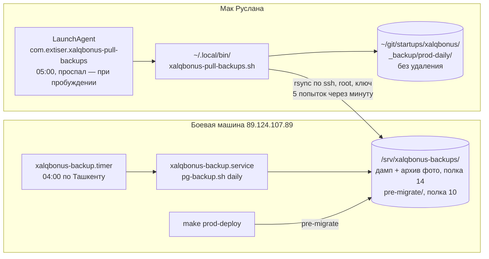

# Ручной выкат и откат

**Штатный и единственный путь обновления прода.** Сервер сам обновляет рабочее дерево,
собирает образ на месте, применяет миграции и поднимает стек. Конвейера GitHub Actions
у проекта нет: выкат запускает человек, набирая команду на боевой машине.

Окружение одно — `prod`. Dev-контура у проекта не существует (`docs/infra.md` →
«Два окружения»), поэтому ни у скриптов, ни у целей `Makefile` нет аргумента окружения:
там, где в исходном образце (OmniBox) стоял разбор `prod|dev`, здесь стоят константы.

Всё ниже исполняется **на боевой машине руками**. Ни CLI, ни Cowork на машину не заходят
никогда (`CLAUDE.md` → «Важные ограничения»).

## Что лежит на машине

| Что | Где |
|---|---|
| Рабочее дерево, оно же каталог выката | `/srv/xalqbonus` |
| Серверный `.env` | `/srv/xalqbonus/.env` |
| Файл последнего годного образа | `/srv/xalqbonus/.last_good_image_tag` |
| Дампы базы по расписанию | `/srv/xalqbonus-backups/` |
| Дампы перед миграцией | `/srv/xalqbonus-backups/pre-migrate/` |
| Копии базы старого бота | `/srv/xalqbonus-backups/legacy-public_*.dump` |
| Выгрузка реестра и отчёт переноса | `/srv/xalqbonus-import/`, владелец `1000:1000` — пользователь `node` образа |
| Образы | `xalqbonus:<short-sha>`, реестра нет — образ живёт только на этой машине |
| **Старый бот** | `/var/www/xalqbonusbot`, процесс под pm2 |
| Node и pm2 старого бота | через nvm, в `PATH` сами не попадают: `source ~/.nvm/nvm.sh` в сеансе, откуда зовут `pm2` |
| **База старого бота** | системный Postgres машины, база `xalqbonus`, доступ `sudo -u postgres` |
| **Входная дверь** | nginx хоста под systemd, вне докера и вне стека |

**Выкат старого бота не касается ни в одной точке.** Он работает только внутри
`/srv/xalqbonus`: обновляет своё дерево, собирает свой образ, поднимает свой стек. Каталог
старого бота, его процесс под pm2 и его записи во входной двери машины скриптам не видны
и не передаются. Общий у них только диск. Баз две: старый бот работает на системном
Postgres машины, наша схема `xb` — в базе контейнера стека, на своём томе (проверено
28-09-2026: схема `public` в базе контейнера пуста). В день выката `public` старого бота
заливается дампом в базу контейнера — раздел «Перенос старой базы в день выката».

Чтобы выкат прошёл, на машине должны существовать: клон репозитория в `/srv/xalqbonus`,
заполненный `.env` в его корне и внешняя сеть `xalqbonus-edge` (её создаёт настройка машины,
а не подъём стека — см. комментарий в `docker/compose.prod.yml`). Каталог дампов заводит
сам скрипт копии базы.

## Входная дверь машины

**Дверь снаружи — nginx хоста, и она не наша.** Он держит 80 и 443, знает домены машины
и хранит сертификаты; на нём же висит webhook работающего старого бота
(`/xalqbonusbot/` → `127.0.0.1:4000`). Заменить его нечем, пока старый бот жив.

Поэтому приложение публикует порт **только на петлевом адресе** — `127.0.0.1:3003`
(`docker/compose.prod.yml`, сервис `app`), а nginx проксирует на него. На всех адресах
порт не публикуется ни под каким предлогом: docker пишет правила в iptables мимо ufw,
и опубликованный на `0.0.0.0` порт фаервол машины не закроет — база на этой машине уже
стояла открытой в интернет по этой же причине.

**`compose.proxy.yml`, `docker/caddy/` и цели `proxy-*` на этой машине не применяются.**
Caddy здесь не поднимется: 80 и 443 заняты nginx. Они лежат в репозитории под переезд
на чистый сервер — тогда дверью станет Caddy, увидит приложение по внешней сети
`xalqbonus-edge`, и петлевая публикация порта станет не нужна. Условие возврата к ним
ровно одно: старый бот и его домены умерли, и машина, на которой стоит стек, больше
никем не занята.

Сеть `xalqbonus-edge` при этом остаётся обязательной для подъёма стека: `compose.prod.yml`
объявляет её внешней, и без неё стек не стартует. Сегодня по ней никто не ходит.

### Конфиг nginx правит человек

Конфигурация машины живёт на машине: в репозитории её нет, целью `Makefile` она
не оформлена и скриптом не применяется. Ниже — **образец** как справка тому, кто правит
машину руками.

Блок `xalq.bonusbot.uz` на 443 на машине уже есть — с выпущенным сертификатом
и редиректом с 80 порта. Приложение заведено в него 09-09-2026 на месте заглушки
`return 404`, которая стояла там до того и сама же этот 404 и отдавала.

Если блок собирается заново, заглушку нужно **заменить**, а не дописать рядом:
двух `location /` в одном `server`-блоке nginx не принимает — `nginx -t` упадёт
с `duplicate location "/"`, и reload не состоится.

Рядом в этом же блоке живут `location /xalqbonusbot/` (webhook старого бота)
и `location /.well-known/acme-challenge/` (продление сертификата). **Оба не трогаются**:
их префиксы совпадают точнее, чем `/`, и nginx выберет их независимо от порядка.

```nginx
server {
    listen 443 ssl;
    server_name xalq.bonusbot.uz;

    # Сертификат и его пути не выдумываются — берутся из существующего блока
    # этого же домена, он уже выпущен и валиден.
    ssl_certificate     /path/to/fullchain.pem;
    ssl_certificate_key /path/to/privkey.pem;

    # Уже существующие правила — не правятся и не переставляются. Здесь только названы,
    # чтобы было видно, что лежит рядом; их тела в образце не воспроизводятся:
    #   location /xalqbonusbot/               — webhook старого бота, 127.0.0.1:4000
    #   location /.well-known/acme-challenge/ — продление сертификата

    # Webhook Telegram. Точное совпадение `=` имеет наивысший приоритет,
    # поэтому порядок правил в блоке значения не имеет.
    location = /api/tg/webhook {
        proxy_pass http://127.0.0.1:3003;
        proxy_http_version 1.1;

        proxy_set_header Host              $host;
        proxy_set_header X-Real-IP         $remote_addr;
        proxy_set_header X-Forwarded-For   $proxy_add_x_forwarded_for;
        proxy_set_header X-Forwarded-Proto $scheme;

        # Апгрейда здесь не бывает: Telegram шлёт обычный POST с JSON,
        # поэтому Upgrade и Connection не пробрасываются.
        client_max_body_size 1m;
    }

    # Mini App водителя. Без auth_basic намеренно, по той же причине, что webhook:
    # пароля Telegram не знает, и под ним приложение не открылось бы ни у одного
    # водителя. Личность здесь доказывает подпись initData, которую проверяет само
    # приложение на каждом запросе, — пароль не добавил бы к ней ничего.
    location /app {
        proxy_pass http://127.0.0.1:3003;
        proxy_http_version 1.1;

        proxy_set_header Host              $host;
        proxy_set_header X-Real-IP         $remote_addr;
        proxy_set_header X-Forwarded-For   $proxy_add_x_forwarded_for;
        proxy_set_header X-Forwarded-Proto $scheme;

        client_max_body_size 1m;
    }

    # Статика сборки. Без неё страница приложения приходит пустой: скрипты уходят
    # за 401, и экран не появляется вовсе.
    location /_nuxt/ {
        proxy_pass http://127.0.0.1:3003;
        proxy_http_version 1.1;

        proxy_set_header Host              $host;
        proxy_set_header X-Real-IP         $remote_addr;
        proxy_set_header X-Forwarded-For   $proxy_add_x_forwarded_for;
        proxy_set_header X-Forwarded-Proto $scheme;
    }

    # Ручки приложения: состояние экрана и регистрация. Каждая проверяет подпись
    # initData сама и без неё не отвечает ничем полезным.
    location /api/miniapp/ {
        proxy_pass http://127.0.0.1:3003;
        proxy_http_version 1.1;

        proxy_set_header Host              $host;
        proxy_set_header X-Real-IP         $remote_addr;
        proxy_set_header X-Forwarded-For   $proxy_add_x_forwarded_for;
        proxy_set_header X-Forwarded-Proto $scheme;

        client_max_body_size 1m;
    }

    # Приложение — на месте заглушки `return 404`, а не рядом с ней.
    # 3003 — порт, опубликованный стеком на петлевом адресе.
    location / {
        proxy_pass http://127.0.0.1:3003;
        proxy_http_version 1.1;

        # Апгрейд соединения: без него не проходят websocket-соединения.
        proxy_set_header Upgrade    $http_upgrade;
        proxy_set_header Connection $connection_upgrade;

        # Адрес и схема клиента. Без них приложение видит запрос как пришедший
        # с петлевого адреса по http и строит абсолютные ссылки не на тот домен.
        proxy_set_header Host              $host;
        proxy_set_header X-Real-IP         $remote_addr;
        proxy_set_header X-Forwarded-For   $proxy_add_x_forwarded_for;
        proxy_set_header X-Forwarded-Proto $scheme;

        # Предел тела запроса — единственная настоящая защита от истощения памяти.
        client_max_body_size 8m;
    }
}
```

`$connection_upgrade` — не встроенная переменная: она задаётся картой в `http`-контексте.
На сегодняшней машине карта заведена 09-09-2026 файлом `/etc/nginx/conf.d/upgrade-map.conf`;
на чистой машине её не будет. Webhook старого бота обходится без неё — у него в заголовке
стоит постоянная строка `Connection 'upgrade'`.

Копировать эту постоянную в блок приложения нельзя. Постоянная объявляет апгрейдом
**каждый** запрос, включая обычные, и ломает keepalive до приложения: соединение после
ответа не переиспользуется, и каждый запрос платит новым подключением. Карта же отдаёт
`upgrade` только там, где апгрейда попросил клиент, и `close` во всех остальных случаях.

Заводится она отдельным файлом в `conf.d` — там `http`-контекст, и карта общая на весь
nginx, а не принадлежит домену:

```nginx
map $http_upgrade $connection_upgrade {
    default upgrade;
    ''      close;
}
```

Если карта на машине к тому времени уже появилась — второй раз её объявлять нельзя,
nginx откажется стартовать.

### `auth_basic` снят: дверь теперь своя

До 12-09-2026 в `location /` стояли `auth_basic` и `.htpasswd-xalq` — один пароль на всех,
без имени в журнале и без разницы между ролями. Стоял он там потому, что своего входа
у приложения не было вовсе, а корень вёл на экран наблюдаемости.

Теперь вход есть: сотрудник входит по телефону и паролю, а **каждая ручка данных
проверяет доступ сама** (`server/utils/employeeAuth.ts`). Без проверки остаются ровно три
вещи — пробы живости, приём апдейтов Telegram и сам вход, — и ни одна из них паролем
не закрывалась бы осмысленно. Поэтому строки `auth_basic` в образце больше нет.

**Снимать пароль раньше, чем закрыты ручки, нельзя.** Между выкатом проверок и снятием
пароля не должно быть окна: пока хоть одна ручка отвечает без сессии, снятый пароль
открывает миру список четырёх тысяч водителей с телефонами и балансами. Поэтому правка
nginx делается тем же выкатом, что и код, — последним его шагом, после `make prod-deploy`
и проверки, что приложение поднялось.

Первым же шагом того дня заводится владелец: снятый пароль без единой учётки открывает
форму входа, в которую некому войти. Весь порядок — разделом «Порядок первого выката
с входом».

Отдельные правила Mini App (`/app`, `/_nuxt/`, `/api/miniapp/`) после снятия пароля стали
избыточными: они существовали ровно затем, чтобы обойти `auth_basic`, а обходить больше
нечего. **Не трогаются**: их префиксы совпадают точнее, чем `/`, ведут они туда же,
и снимать работающие правила заодно с паролем значит менять две вещи одной рукой.

### Webhook не прячется за пароль

Правило пережило снятие `auth_basic` и остаётся верным на случай, если пароль когда-нибудь
вернут — на весь домен или на его часть.

Пароль на уровне `server`, а не внутри `location`, наследуется в webhook старого бота
и в `acme-challenge`: Telegram получал бы 401 на каждый апдейт, certbot не продлил бы
сертификат. По той же причине webhook нового бота вынесен отдельным `location`.

Правило, попавшее под `auth_basic`, ломается молча: Telegram копит недоставленные
апдейты, а в логах приложения нет ни одной записи — запрос до него не доходит.
Подлинность запроса проверяет само приложение по заголовку
`X-Telegram-Bot-Api-Secret-Token`, поэтому пароль здесь ничего и не защищал бы.

Следствие снятия: `/api/health` и `/api/ready` снаружи открыты. Отвечают они состоянием
процесса и доступностью базы с очередью, и ничего о людях парка не знают; мониторингу,
когда он появится, своего `location` теперь не понадобится.

### Ротация `TG_WEBHOOK_SECRET`

Смена одного лишь секрета в `.env` до Telegram не доезжает. При старте `setWebhook`
вызывается только при расхождении адреса (`server/bot/start.ts`, `ensureWebhook`),
а секрет `getWebhookInfo` не возвращает вовсе — такого поля у ответа нет, сравнивать
не с чем. После перезапуска Telegram продолжает слать прежний секрет, приложение отвечает
401, апдейты копятся у него в очереди. Снаружи это выглядит как «бот замолчал»; в логе
приложения строка при этом есть.

Порядок ротации на боевой машине:

```bash
cd /srv/xalqbonus
# 1. поменять TG_WEBHOOK_SECRET в .env, затем поднять стек с новым значением
make prod-restart

# 2. переставить webhook вручную — тем же адресом и новым секретом
set -a; . /srv/xalqbonus/.env; set +a
curl -sS -X POST "https://api.telegram.org/bot$TG_BOT_TOKEN/setWebhook" \
  -d "url=$TG_WEBHOOK_URL" \
  -d "secret_token=$TG_WEBHOOK_SECRET"

# 3. убедиться, что Telegram доволен: last_error_message пуст, pending_update_count не растёт
curl -sS "https://api.telegram.org/bot$TG_BOT_TOKEN/getWebhookInfo"
```

Секреты берутся из `.env`, а не набираются руками: набранный с опечаткой токен уходит
в историю команд, а набранный с опечаткой секрет ломает доставку молча.

`drop_pending_updates` не передаётся намеренно — апдейты, накопленные за время ротации,
должны доехать.

Порядок шагов важен: если переставить webhook раньше перезапуска, приложение ещё живёт
со старым секретом и начнёт отбивать апдейты само.

Порядок правки: изменить конфиг → `nginx -t` → `systemctl reload nginx`. Перечитывание
соединения не рвёт; процесс старого бота под pm2 при этом не перезапускается и его
не касается.

## Журнал скриптов

Выкат, откат и копия базы пишут журнал одного вида — по строке на шаг, четыре поля:

```
[2026-09-08T15:41:14Z] INFO  сборка          docker build → xalqbonus:a1b2c3d
[2026-09-08T15:41:14Z] WARN  уборка/образы   не снят a1b2c3d — conflict: unable to delete a1b2c3d
[2026-09-08T15:41:14Z] ERROR готовность      не получена за 5 попыток — запускается откат
```

- **Время** — UTC, всегда.
- **Уровень** — `INFO` (шаг прошёл), `WARN` (отказ, работу не отменяющий), `ERROR` (скрипт
  останавливается или запускает откат). Уровня между ними нет намеренно: в аварии важно
  одно — продолжилась работа или нет.
- **Шаг** — короткое стабильное имя этапа, общее на все скрипты: `старт`, `дерево`,
  `зависимости`, `бэкап`, `сборка`, `миграция`, `подъём`, `готовность`, `версия`, `уборка`,
  `уборка/образы`, `уборка/кеш`, `уборка/итог`, `откат`, `заливка`, `итог`. По последней строке журнала
  видно, на чём прогон остановился.

Функция вывода одна на все скрипты — `docker/scripts/_log.sh`; цветов нет, вывод уходит
в файлы и в системный журнал. Мимо формата идут ровно две вещи: подсказка по вызову
при неверных аргументах (адресована человеку у терминала прямо сейчас) и вывод команды
уборки при её неудаче — он показывается целиком, причина в нём.

У всех шести скриптов есть `--help`; `_log.sh` и `_common.sh` при прямом запуске печатают,
чем они являются, и ничего не делают — их подключают через `source`.

## Порядок первого выката с входом

**Делается один раз за жизнь машины** — в тот выкат, которым на прод приезжает вход
сотрудников. Дальше выкаты идут штатно, разделом ниже.

Порядок здесь и есть содержание: между шагами 3 и 4 окна, в котором данные открыты миру,
быть не должно, а между 1 и 4 — окна, в котором форма входа открыта, а войти в неё некому.

1. **Владелец заводится первым, до всего остального.** Приглашением `owner` не создаётся:
   приглашать можно роль строго ниже своей, а выше владельца ролей нет. Вся цепочка учёток
   начинается с него — владелец приглашает админов, админы менеджеров, — и до тех пор
   в системе нет ни одного человека, который мог бы войти:

   ```bash
   cd /srv/xalqbonus
   make prod-employee-owner phone=+998XXXXXXXXX name="Имя Фамилия" password=<пароль>
   ```

   Цель идемпотентна: повторный прогон на существующем телефоне второй учётки не создаёт
   и пароль не меняет. Пароль приходит аргументом и остаётся в истории команд — сменить
   его стоит из приложения, своей же учёткой, сразу после первого входа.

   Заводится владелец **до** снятия `auth_basic`, а не после: снятый пароль без единой
   учётки открывает миру форму входа, в которую некому войти, — и на то время, пока
   владельца заводят, приложение стоит без всякой двери.

   Цель зовёт не `npx tsx scripts/...`, а собранный бандл `.output/create-owner.mjs`:
   в боевом образе нет ни исходников, ни tsx (`docker/Dockerfile`). Локальная
   `make employee-owner` ходит в локальный стек и на машине не применяется никогда —
   она либо не найдёт контейнеров, либо заведёт владельца не в ту базу.

2. **Штатный выкат** — `make prod-deploy`, порядок шагов разделом ниже. На этом шаге
   на машину приезжают проверки доступа во всех ручках. Пароль nginx ещё стоит.

3. **Проверка, что вход работает под паролем nginx.** Браузер спросит пароль дважды —
   сперва nginx, потом форма приложения. Вошли под владельцем, увидели своё имя в шапке
   и список водителей — значит снимать пароль можно.

4. **Снятие `auth_basic`** — последним шагом, разделом «`auth_basic` снят: дверь теперь
   своя» выше. Правится конфиг машины, `nginx -t`, `systemctl reload nginx`.

5. **Проверка снаружи:** корень открывает форму входа без окна пароля браузера, `/app`
   открывается, webhook старого бота жив.

Если что-то пошло не так между шагами 2 и 4, возвращать пароль не нужно: он никуда
и не девался. Откат образа — разделом «Откат образа» ниже.

## Перенос старой базы в день выката

**Делается один раз за жизнь машины**, руками, по шагам из консоли. Одной командой, которая
делает всё, этот сценарий не оформлен намеренно: между шагами человек смотрит на результат
и решает, идти ли дальше. Переключение бота на новый — webhook, pm2 — сюда не входит,
это отдельный раздел — «Переключение бота» ниже, и исполняется он посередине переноса:
после шага 8, до шага 9.

Что переносится и как устроен сам перенос — `scripts/import-legacy.ts`. Здесь — как он
исполняется на машине, где его окружение отличается от локального в трёх местах: `public`
старого бота лежит в другой базе, в образе нет ни исходников, ни tsx, а `xb` не пуста.

**До дня выката:**

- Репетиция на копии прода прошла до отчёта, отчёт разобран — `scripts/rehearse-legacy-import.sh`
- На машине выкачен образ с бандлом переноса. Проверка:

  ```bash
  cd /srv/xalqbonus
  make prod-import-legacy-check
  ```

- Заведён каталог выгрузки и отчёта. Владелец — `1000:1000`: перенос идёт одноразовым
  контейнером под пользователем `node` образа, и отчёт он пишет туда сам:

  ```bash
  install -d -o 1000 -g 1000 -m 700 /srv/xalqbonus-import
  ```

Все команды ниже — из `/srv/xalqbonus`, под `root`.

### 1. Копия машины и копия базы

Снимок машины — в панели VDSina. Потом копия базы контейнера на полку «перед миграцией»:
к ней возвращаются, если перенос придётся откатывать (шаг 11).

```bash
bash docker/scripts/pg-backup.sh pre-migrate
ls -1 /srv/xalqbonus-backups/pre-migrate/ | tail -n 1   # запомнить имя: это точка отката
```

### 2. Остановка старого бота и нового стека

Старый бот гасится до дампа его базы — иначе баланс водителя, изменившийся между дампом
и остановкой, в перенос не попадёт. Процесс под pm2, а pm2 — под nvm:

```bash
source ~/.nvm/nvm.sh
pm2 stop xalqbonusbot
pm2 ls                        # xalqbonusbot — stopped
```

Приложение и воркер нового стека тоже гасятся — до шага 9. Перенос пишет привязки
Telegram и участие в программе; водитель, проходящий регистрацию в Mini App в ту же минуту,
пишет их же, и одна привязка на чат держится уникальным индексом — прогон упал бы на ней.
База и очередь остаются поднятыми:

```bash
make prod-stop services="app worker"
```

### 3. Дамп `public` старого бота

Уже после остановки: балансы больше не меняются. Файл кладётся на полку копий — это последнее
состояние старой базы, и оно уедет на Мак со следующим забором:

```bash
LEGACY_DUMP=/srv/xalqbonus-backups/legacy-public_final_$(date -u +%Y%m%d_%H%M%S).dump
(cd / && sudo -u postgres pg_dump -Fc -n public xalqbonus) > "$LEGACY_DUMP"
pg_restore -f /dev/null "$LEGACY_DUMP" && ls -l "$LEGACY_DUMP"   # читается целиком, ~60 МБ
```

### 4. Свежая выгрузка реестра парка

`scripts/export-registry.py` — тем же скриптом, что делал все прошлые выгрузки, на ключах
из серверного `.env`. Идёт около
получаса. Реестр приходит из Fleet API, а не из старой базы, поэтому этот шаг можно
запустить во втором терминале сразу после шага 1 и не держать парк без бота лишние полчаса.
Оборванная выгрузка продолжается с того же места повторным запуском; `--restart` начинает
с нуля.

```bash
python3 scripts/export-registry.py
ls -l _reference/fleet-api/dumps/                       # driver-profiles-<дата>.jsonl и .meta.json
cp _reference/fleet-api/dumps/driver-profiles-<дата>.jsonl \
   _reference/fleet-api/dumps/driver-profiles-<дата>.meta.json \
   /srv/xalqbonus-import/
```

Файл `.meta.json` обязателен и лежит рядом с выгрузкой: по нему ставится отметка
синхронизации реестра. `_reference/` в образ не едет (`.dockerignore`).

### 5. Заливка `public`

Заливка — в базу контейнера, туда, где живёт `xb`. Отказывает, если в `public` уже есть
таблицы, и идёт одной транзакцией: или вся схема, или ничего.

```bash
# LEGACY_DUMP — из шага 3; в другом сеансе — полный путь файла legacy-public_final_*.dump
bash docker/scripts/restore-legacy-public.sh prod "$LEGACY_DUMP"
# итог: public базы xalqbonus: таблиц 20, записей Drivers ~4 200 · таблиц xb …
```

### 6. Столкновения привязок

Перенос открывает активную привязку Telegram каждой сопоставленной записи старой базы,
а одна активная привязка на чат и одна на человека держатся уникальными индексами. Живая
привязка в `xb`, стоящая поперёк, — демо-зритель, проверочная учётка, водитель, прошедший
регистрацию в Mini App с другого Telegram, — роняет перенос посередине, и повтор падает там
же. Запрос перечисляет такие привязки заранее. Он только читает, а записи старой базы берёт
из `public`, поэтому стоит после заливки, а не до неё:

```bash
make prod-sql file=docker/scripts/legacy-link-collisions.sql
echo "код: $?"          # 0 — столкновений нет, идти дальше
```

**Непустой вывод — остановиться.** Автоматики нет намеренно: каждую строку решает человек —
чья это привязка и какой из двух каналов оставить. Колонки: вид столкновения, `Drivers.id`
записи, оба чата, `id` и `person_id` живой привязки, признак демо (`is_demo` и строка
в `demo_viewers`), лежит ли профиль записи в `xb` уже сейчас.

Если решено закрыть живую привязку — руками, в `make prod-psql`, по `id` из вывода.
На репетиции — тем же SQL в базе репетиции, `make psql db=xalqbonus_0928`.
Обычная привязка:

```sql
UPDATE xb.telegram_links
   SET closed_at = now(), close_reason = 'operator'
 WHERE id = '<привязка>' AND closed_at IS NULL;
```

Привязка демо-зрителя закрывается вместе с выключением зрителя — так же, как это делает
раздел «Демо» веба, одной транзакцией: закрытая привязка при действующем зрителе оставила бы
его в списке с мёртвым демо-водителем. Приложение на этом шаге погашено, поэтому — SQL:

```sql
BEGIN;
UPDATE xb.demo_viewers
   SET disabled_at = now(), updated_at = now()
 WHERE person_id = '<person_id привязки>' AND disabled_at IS NULL;
UPDATE xb.telegram_links
   SET closed_at = now(), close_reason = 'demo'
 WHERE id = '<привязка>' AND closed_at IS NULL;
COMMIT;
```

После правок запрос прогоняется ещё раз — до пустого вывода.

### 7. Перенос и отчёт

Перенос — бандлом из образа, одноразовым контейнером `app`, целью `prod-import-legacy`.
Каталог выгрузки `/srv/xalqbonus-import` монтируется внутрь, отчёт ложится туда же, на хост;
`profiles=` и `report=` — имена файлов в нём, без пути. Строка подключения — `DATABASE_URL`
из `.env`: она уже смотрит в базу контейнера, где теперь лежат обе схемы.

```bash
make prod-import-legacy profiles=driver-profiles-<дата>.jsonl report=import-report.md
echo "код: $?"
```

Цель отказывает до запуска, если выгрузки или её `.meta.json` в каталоге нет.

Код `0` — прогон прошёл и контрольные цифры сошлись. Не `0` — последние строки вывода
называют причину; отчёт при расхождении контрольных цифр всё равно ложится на диск.

Отчёт — `/srv/xalqbonus-import/import-report.md`, персональных данных в нём нет, его можно
забрать на Мак и разбирать в Cowork. Смотреть по порядку:

- **«Контрольные цифры»** — во всех семи строках «сошлось: да». Эталон снят с этого же дампа
  в начале прогона
- **«Сопоставление»** — «не сопоставлено» и «непригодных `chat_id`»: сравнить с репетицией,
  порядок должен совпасть
- **«Участие в программе»** — «из них активных» и «привязок не создано из-за непригодного
  `chat_id`»
- **«Балансы»** — «перенесено операциями `opening`» равно эталону; «сумма балансов в `xb`»
  больше него ровно на то, что лежало на живых счетах до переноса (демо, проверочные учётки)
- **«Засчитанные старым ботом заказы»** — строка «засчитанных старым ботом заказов: N, период
  с … по …»; порядок — около 11 тысяч за неделю, период кончается остановкой старого бота
- **«Отметка синхронизации»** — `sync_state` вида `registry` равна началу выгрузки минус сутки

У водителей, прошедших регистрацию в Mini App до переноса, язык, дата вступления
и `joined_source` становятся теми, что в старой базе, — так и задумано: запись старой базы
и есть их первое вступление в программу.

### 8. Инварианты

```bash
make prod-invariants          # пустой вывод и код 0
```

Стек поднимается только после инвариантов, не раньше: расхождение, найденное при поднятом
приложении, водители успеют увидеть.

**Дальше — раздел «Переключение бота» ниже, затем возврат к шагу 9.** Переключение стоит
здесь, а не после шага 10: догоняющий прогон шага 10 может идти часами, и бот, молчащий
со шага 2, молчал бы всё это время. Раздел поднимает `app` и `worker` уже с боевым ботом
и выключенной синхронизацией; шаги 9 и 10 идут при живом боте.

### 9. Включение синхронизации

К началу шага `app` и `worker` уже работают с боевым ботом — их поднял раздел «Переключение
бота». В `.env` машины — живой опрос заказов и синхронизация реестра, затем `make prod-start`:
compose видит изменённый `.env` и пересоздаёт оба контейнера. Приложения нет несколько секунд;
апдейты, пришедшие за это время, ждут у Telegram и доезжают после подъёма, webhook
не переставляется — адрес у Telegram уже наш:

```bash
sed -i -e 's/^SYNC_LIVE_ENABLED=.*/SYNC_LIVE_ENABLED=true/' \
       -e 's/^SYNC_REGISTRY_ENABLED=.*/SYNC_REGISTRY_ENABLED=true/' .env
grep -E '^SYNC_(LIVE|CATCHUP|REGISTRY)_ENABLED=' .env   # LIVE и REGISTRY — true, CATCHUP — false
make prod-start services="app worker"
```

Расписание BullMQ с интервалом исполняет первую задачу сразу, не дожидаясь интервала.
Поэтому оба вида идут в первые секунды после подъёма воркера:

- **`orders`** без отметки берёт окно в десять минут перекрытия до текущего момента, то есть
  время, когда старый бот уже стоял;
- **`registry`** идёт от отметки, поставленной переносом, — начало выгрузки минус сутки.

Проверка — сводка синхронизации тем же запросом, что `make sync-state` локально:

```bash
make prod-sql file=scripts/sync-state.sql
```

Отметки `orders` и `registry` появились и идут за временем, последние прогоны — со статусом
успеха. Затем `make prod-invariants` ещё раз.

`SYNC_CATCHUP_ENABLED` на этом шаге **не включается** — следующий шаг.

### 10. Догоняющий прогон `orders_catchup`

> **Не раньше, чем на проде выкачен #274 «поездки, за которые балл дал старый бот,
> не начисляются второй раз» и в `xb.legacy_awarded_trips` легли засчитанные заказы.**
> Проход догона берёт `SYNC_CATCHUP_DAYS` назад — неделю — и без этой таблицы начислил
> бы повторно неделю поездок, уже лежащих в перенесённых балансах.

Если перенос шага 7 прошёл на образе без этого шага — в его отчёте нет раздела «Засчитанные
старым ботом заказы», — шаг запускается отдельно, тем же бандлом, без выгрузки реестра
и без остальных шагов. `public` к этому моменту уже лежит в базе контейнера (шаг 5):

```bash
make prod-import-legacy-awarded-trips report=import-report-awarded-trips.md
echo "код: $?"
```

Отчёт — `/srv/xalqbonus-import/import-report-awarded-trips.md`, строка «засчитанных старым
ботом заказов: N, период с … по …».

Отбор — 14 дней назад от момента запуска: после остановки старого бота его лучше не
откладывать дольше недели. Повтор безопасен — строк не добавит.

Отдельного разового запуска догона на машине нет и не нужно: догон включается выключателем
и проходит сам, по расписанию. Устройство — `server/services/sync/buildOrdersWindow.ts`:

- **проход** — полоса `[pass_from, pass_to]`, где `pass_to` — момент начала прохода минус
  отставание, а `pass_from` — на `SYNC_CATCHUP_DAYS` раньше. Границы фиксируются при начале
  прохода и до его конца не сдвигаются — `SYNC_CATCHUP_DAYS`, поменянный посреди прохода,
  подействует только на следующий;
- проход режется на **куски** по `SYNC_CATCHUP_SLICE_HOURS` (12 часов), куски идут от старых
  к новым, каждый — своя строка `orders_catchup` в журнале прогонов;
- **позиция** — отметка `orders_catchup`: конец последнего пройденного куска. Двигается
  после каждого куска. Кусок, упавший по лимиту, позицию не трогает и повторяется
  со следующего запуска — раз в `SYNC_CATCHUP_INTERVAL_SEC` (15 минут);
- пройденный проход ждёт следующего `SYNC_CATCHUP_PASS_EVERY_HOURS` (сутки) от своего конца,
  запросов во Fleet за это время нет.

```bash
sed -i 's/^SYNC_CATCHUP_ENABLED=.*/SYNC_CATCHUP_ENABLED=true/' .env
grep -E '^SYNC_CATCHUP_' .env   # INTERVAL_SEC — 900 или строки нет: 86400 значит попытку раз в сутки
make prod-start services="app worker"
```

`app` пересоздаётся вместе с воркером: порог тревоги на экране считается от тех же
настроек, что читает воркер.

Проверка — та же сводка синхронизации, что на шаге 9:

```bash
make prod-sql file=scripts/sync-state.sql
```

В отметках у `orders_catchup` заполнены `pass_from` и `pass_to`, а `watermark` идёт
от первого ко второму. В последних прогонах — строки `orders_catchup` по кускам: окна
по 12 часов подряд от старых к новым, счётчики начислений правдоподобны, колонка «засчитал
старый бот» ненулевая. Упавший кусок — строка `failed`, и через четверть часа тот же кусок
идёт снова. То же видно на экране «Синхронизация», карточка «Заказы, догоняющий»: проход
с … по …, пройдено до …, «идёт» / «пройден». Когда проход пройден — `make prod-invariants`.

#### Первый проход после выката догона кусками

Выкат, в котором догон режется на куски (issue #286), пришёл после дня переноса. Догон
28-09-2026 брал неделю 21.09 14:48 – 28.09 14:48 UTC и закрыл из неё только
27.09 04:22 – 28.09 14:48: Fleet отдаёт заказы от новых к старым, и лимит оборвал прогон
на четырнадцатой странице. Остаток — заказы с временем завершения
**с 2026-09-21 14:48 UTC** по 2026-09-27 04:22 UTC — не пройден. Первый проход обязан его
накрыть, поэтому `SYNC_CATCHUP_DAYS` на него считается, а не берётся по умолчанию.

**До `make prod-deploy` этой версии** — выключить догон, если он включён: иначе воркер
новой версии начнёт первый проход при подъёме, с тем числом дней, что лежит в `.env`,
и его границы до конца прохода уже не сдвинуть:

```bash
sed -i 's/^SYNC_CATCHUP_ENABLED=.*/SYNC_CATCHUP_ENABLED=false/' .env
```

После выката, в момент запуска, `SYNC_CATCHUP_DAYS` — целое число дней, при котором
выполнены оба условия:

1. **не меньше**, чем прошло от 2026-09-21 14:48 UTC до момента запуска, округлённого вверх
   до целых дней: тогда `pass_from` не позже начала непройденного остатка;
2. **не больше**, чем прошло от **2026-09-14 14:32:38 UTC** до момента запуска, округлённого
   вниз. Это граница отбора засчитанных старым ботом заказов — в отчёте переноса строка
   «бронирование за 14 дней — с 2026-09-14T14:32:38Z». Заказ, завершённый раньше этой
   точки, в `xb.legacy_awarded_trips` не попал, и проход глубже неё начислил бы второй раз
   то, что уже лежит в перенесённом балансе.

Берётся наименьшее число, выполняющее первое условие. Запас до второго — около недели,
и расходовать его незачем: отбор старого бота шёл по времени бронирования, а проход — по
времени завершения, и чем дальше `pass_from` от границы отбора, тем меньше заказов,
забронированных до неё и завершённых после.

Пример: запуск 2026-09-29 10:00 UTC. От 21.09 14:48 прошло 7 суток 19 часов 12 минут —
по первому условию не меньше 8. От 14.09 14:32:38 прошло 14 суток 19 часов — по второму
не больше 14. `SYNC_CATCHUP_DAYS=8`, `pass_from` — 2026-09-21 09:59 UTC.

```bash
sed -i -e 's/^SYNC_CATCHUP_DAYS=.*/SYNC_CATCHUP_DAYS=8/' \
       -e 's/^SYNC_CATCHUP_INTERVAL_SEC=.*/SYNC_CATCHUP_INTERVAL_SEC=900/' \
       -e 's/^SYNC_CATCHUP_ENABLED=.*/SYNC_CATCHUP_ENABLED=true/' .env
grep -E '^SYNC_CATCHUP_' .env
make prod-start services="app worker"
```

Число `8` здесь — из примера, в день запуска оно считается заново по правилу выше. В сводке
сразу после подъёма — `pass_from` у `orders_catchup` не позже 2026-09-21 14:48 UTC и не раньше
2026-09-14 14:32:38 UTC. Если это не так — выключатель в `false` и остановиться: проход
с такими границами до конца не должен дойти.

Когда проход пройден — сводка показывает `watermark = pass_to`, карточка «пройден» —
`make prod-invariants`, затем вернуть ширину по умолчанию до начала следующего прохода,
то есть в пределах суток от `pass_to`:

```bash
sed -i 's/^SYNC_CATCHUP_DAYS=.*/SYNC_CATCHUP_DAYS=7/' .env
make prod-start services="app worker"
```

### 11. Если перенос упал посередине

**Повторный запуск — та же команда шага 7.** Шаги переноса идемпотентны по отдельности:
второго человека, второй привязки и второй операции `opening` повтор не создаст, а отчёт
допишет, сколько операций было записано раньше. Заливку `public` повторять не нужно — она
уже прошла, и скрипт откажет на непустой схеме.

**Упал второй раз на том же месте — не запускать в третий.** Ошибка детерминирована:
данные, а не сеть. Текст ошибки и отчёт (если лёг) — в Cowork, исправление приезжает
выкатом.

**Базу откатывать из копии шага 1, если:**

- переносу предстоит идти **с другим дампом `public`** — старый бот поднимается обратно,
  и следующий перенос будет в другой день. Операция `opening` пишется одна на человека,
  и повтор по ключу **не обновит сумму**: на новом дампе перенос оставил бы старые балансы
  и остановился бы на контрольных цифрах;
- перенос остановился на контрольных цифрах, а операции `opening` уже записаны.

Откат — со старым ботом, по-прежнему остановленным, и с остановленными `app` и `worker`:

```bash
make prod-psql
#   DROP SCHEMA xb CASCADE;
#   DROP SCHEMA public CASCADE;
#   CREATE SCHEMA public;
#   \q
make prod-db-restore dump=/srv/xalqbonus-backups/pre-migrate/<файл шага 1>.sql.gz
make prod-start services="app worker"
source ~/.nvm/nvm.sh && pm2 start xalqbonusbot    # старый бот обратно
```

Схемы сносятся перед заливкой потому, что копия снята без `--clean`: поверх существующих
таблиц она упала бы на первом же `CREATE`. `public` в копии шага 1 пуста — она снята до
заливки, — и после отката остаётся пустой. База старого бота во всём этом не участвует:
перенос её только читал, и то — из копии.

## Переключение бота

**Делается один раз за жизнь машины**, в день переноса, руками — между шагами 8 и 9
переноса: после инвариантов, до включения синхронизации. К этому моменту старый бот
остановлен, `app` и `worker` погашены — оба со шага 2 переноса; в `.env` стендовый токен
`@dev_xalqbonus_bot`, синхронизация ещё не включена. Шаг 4 раздела поднимает `app` и `worker`
с боевым токеном и по-прежнему выключенной синхронизацией, после раздела — возврат к шагу 9
переноса. Раздел переводит на новый
стек боевого `@xalqbonusbot` — тем же токеном, которым работал старый бот (docs/decisions.md →
«Тестовых ботов два»). Двух ботов на машине не живёт ни в какой момент: стендовый снимается
раньше, чем в `.env` приходит боевой.

Одной командой переключение не оформлено намеренно, по той же причине, что перенос: между
шагами человек смотрит на ответ Telegram и решает, идти ли дальше. Все команды —
из `/srv/xalqbonus`, под `root`. Токен в команды не вписывается нигде: он берётся из `.env`,
как в «Ротации `TG_WEBHOOK_SECRET`», и в историю команд не попадает.

**До дня переноса** — профиль `@xalqbonusbot` в BotFather оформлен: имя, About, описание
и картинка пустого чата, аватар, команда `/start`, Launch Screen, группы выключены. **Кроме
кнопки меню и Main App** — они переставляются только шагом 6: пока работает старый бот,
кнопка на новый адрес увела бы водителей в приложение до переноса.

### 1. Закрепить остановку старого бота

Старый бот погашен на шаге 2 переноса, но только в памяти pm2: после перезагрузки машины
pm2 поднимает список из последнего `pm2 save`, а не текущее состояние. `pm2 save` переписывает
этот список текущим:

```bash
source ~/.nvm/nvm.sh
pm2 save
pm2 ls                        # xalqbonusbot — stopped
```

`pm2 save` что-то закрепляет, только если у pm2 на машине заведён автозапуск — systemd-юнит,
созданный `pm2 startup`. Есть ли он, из репозитория не видно:

```bash
systemctl list-unit-files 'pm2-*.service'
```

- строка `pm2-root.service  enabled` — автозапуск есть; без `pm2 save` старый бот поднялся бы
  после первой же перезагрузки и встал бы в очередь за webhook. `pm2 save` выше эту дыру
  закрыл;
- `0 unit files listed.` или юнит в состоянии `disabled` — автозапуска нет, старый бот после
  перезагрузки не поднимется и так; `pm2 save` безвреден.

### 2. Снять webhook стендового бота

В `.env` пока стендовый токен. Его webhook смотрит на наш адрес, и если его не снять, стендовый
бот продолжит слать апдейты на боевую ручку — с тем же секретом, так что приложение, живущее
уже с боевым токеном, примет их и ответит от имени боевого. Снимается до замены токена,
этим же токеном:

```bash
set -a; . /srv/xalqbonus/.env; set +a
curl -sS "https://api.telegram.org/bot$TG_BOT_TOKEN/getMe"             # "username":"dev_xalqbonus_bot"
curl -sS -X POST "https://api.telegram.org/bot$TG_BOT_TOKEN/deleteWebhook"
curl -sS "https://api.telegram.org/bot$TG_BOT_TOKEN/getWebhookInfo"    # "url":""
```

`getMe` — первым: если в ответе не `dev_xalqbonus_bot`, в `.env` уже не стендовый токен,
и `deleteWebhook` снял бы webhook не у того бота. Остановиться и разобраться.

`app` на этом шаге погашен со шага 2 переноса, и стендовый бот сейчас получает от nginx
`502`. Webhook снимается всё равно: после шага 4 за этим адресом снова будет приложение,
и апдейты стендового бота дошли бы до него.

### 3. Токен боевого бота в `.env`

`.env` правится **редактором**, не `sed`: токен, набранный в командной строке, остаётся
в истории. Меняется ровно одна строка:

```bash
nano /srv/xalqbonus/.env      # TG_BOT_TOKEN=<токен @xalqbonusbot>
```

Всё остальное, что касается Telegram, остаётся как было — оно описывает наш адрес, а не бота:

| Переменная | Значение | Почему не меняется |
|---|---|---|
| `TG_BOT_MODE` | `webhook` | режим доставки на этой машине, а не свойство бота (`server/bot/config.ts`) |
| `TG_WEBHOOK_URL` | `https://xalq.bonusbot.uz/api/tg/webhook` | адрес нашей ручки; под него заведено правило nginx точным совпадением |
| `TG_WEBHOOK_SECRET` | прежнее | секрет наш, а не бота: `ensureWebhook` передаёт его в `setWebhook` (`server/bot/start.ts`), и шаг 4 ставит webhook заново уже с ним — ротация не нужна |
| `TG_MINIAPP_URL` | `https://xalq.bonusbot.uz/app` | адрес приложения — кнопка под приветствием `/start` и под рассылками (`server/bot/launchButton.ts`) |

Переменной с именем бота нет и заводить её не нужно: имя спрашивается у Telegram `getMe`
по токену и кэшируется на процесс, отдельно для каждого токена
(`server/adapters/telegram/botIdentity.ts`). Контейнеры шаг 4 пересоздаёт, и ссылки
`t.me/xalqbonusbot?start=…` собираются с новым именем сразу.

Проверка, что в `.env` тот токен, — до подъёма:

```bash
set -a; . /srv/xalqbonus/.env; set +a
curl -sS "https://api.telegram.org/bot$TG_BOT_TOKEN/getMe"             # "username":"xalqbonusbot"
curl -sS "https://api.telegram.org/bot$TG_BOT_TOKEN/getWebhookInfo"
```

`getWebhookInfo` боевого бота сейчас показывает адрес старого бота
`https://xalq.bonusbot.uz/xalqbonusbot/bot`, ошибку вида `502 Bad Gateway` в
`last_error_message` — процесса за этим адресом нет со шага 2 переноса — и ненулевой
`pending_update_count`: это водители, писавшие боту во время переноса. Их апдейты Telegram
держит у себя до суток и отдаст новому адресу.

### 4. Подъём `app` и `worker` с боевым токеном

Оба погашены со шага 2 переноса; `.env` изменился, поэтому compose не запускает прежние
контейнеры, а пересоздаёт их. `worker` поднимается вместе с `app`: уведомления и рассылки
он шлёт своим токеном.

Синхронизация на этом шаге остаётся выключенной — её включает шаг 9 переноса, после
раздела. Проверка до подъёма:

```bash
grep -E '^SYNC_(LIVE|CATCHUP|REGISTRY)_ENABLED=' .env   # все три — false
make prod-start services="app worker"
make prod-logs services=app   # выход — Ctrl+C, стек при этом не гасится
```

Какая-то из трёх — `true`: опрос Fleet пошёл бы с подъёмом воркера, раньше шага 9 и мимо
его проверок. Поправить в `false` до `make prod-start`.

Балансы в приложении на этот момент — перенесённые, на остановку старого бота: поездки
после неё начисляются шагами 9 и 10.

Webhook ставит само приложение: `ensureWebhook` видит у Telegram адрес старого бота, он
не совпадает с `TG_WEBHOOK_URL`, и `setWebhook` вызывается с нашим адресом и секретом.
`drop_pending_updates` не передаётся — накопленное за перенос доедет. В логе — две строки:

- `webhook переставлен` с `from: https://xalq.bonusbot.uz/xalqbonusbot/bot`
  и `to: https://xalq.bonusbot.uz/api/tg/webhook`;
- `бот поднят` с `username: xalqbonusbot`.

`from: null` вместо адреса старого бота — значит в `.env` всё ещё стендовый токен (его webhook
снят шагом 2): вернуться к шагу 3. `webhook уже стоит на нашем адресе` — то же самое,
если шаг 2 пропущен.

### 5. Проверка доставки

```bash
set -a; . /srv/xalqbonus/.env; set +a
curl -sS "https://api.telegram.org/bot$TG_BOT_TOKEN/getWebhookInfo"
```

- `url` — `https://xalq.bonusbot.uz/api/tg/webhook`;
- `last_error_message` отсутствует — или относится ко времени до переключения: `last_error_date`
  раньше подъёма на шаге 4;
- `pending_update_count` падает до нуля и не растёт на повторных запросах.

Накопленные апдейты разбираются в первые минуты после подъёма: водитель, написавший боту во
время переноса, получает ответ сейчас, без повторного сообщения. `pending_update_count`, который
растёт, при свежей ошибке в `last_error_message` — смотреть лог `app`: причина там.

### 6. Кнопка меню и Main App

Сначала — записать, что стоит сейчас: это состояние возвращает откат.

```bash
curl -sS "https://api.telegram.org/bot$TG_BOT_TOKEN/getChatMenuButton"
```

Ответ `"type":"commands"` или `"type":"default"` — кнопки приложения у старого бота нет;
`"type":"web_app"` — записать его `url`. Main App через Bot API не читается: его текущее
значение смотрится в BotFather, там же, где правится, и записывается так же.

Затем в BotFather у `@xalqbonusbot` — кнопка меню и Main App на `https://xalq.bonusbot.uz/app`.
Тот же адрес стоит в `TG_MINIAPP_URL`: кнопка меню и кнопка под `/start` открывают одно
приложение.

### 7. Живая проверка

С Telegram Руслана:

- `/start` в `@xalqbonusbot` — приветствие с кнопкой приложения;
- кнопка меню открывает Mini App, баланс совпадает с перенесённым;
- в вебе, «Сотрудники» → своя строка → ссылка привязки Telegram: ведёт в `t.me/xalqbonusbot`,
  бот принимает её и отвечает;
- нажать inline-кнопку под старым сообщением старого бота в чате `@xalqbonusbot` — индикатор
  загрузки на кнопке гаснет сразу, в чат приходит приветствие с кнопкой приложения. Такие
  нажатия приходят и из очереди — водители жали кнопки, пока бот стоял;
- если в чате с `@xalqbonusbot` осталась клавиатура старого бота под полем ввода — кнопка
  отправки контакта или значок клавиатуры в поле ввода, — после первого приветствия её нет,
  а в чате одно сообщение бота — приветствие.

Что происходит с нажатием, по коду. Апдейт вида `callback_query` проходит строку лога
`апдейт принят` с `kind: callback_query` (`server/bot/instance.ts`) и доходит до приветствия
(`server/bot/greeting.ts`): своих inline-кнопок у нового бота нет, и нажатие любой кнопки —
это кнопка старого. Разбирать `callback_data` бот не пытается. Первым делом он отвечает
на нажатие `answerCallbackQuery` без текста — индикатор на кнопке гаснет, — затем шлёт то же
приветствие, что на сообщение: тот же текст, водительский или сотрудника, тот же язык
из настроек Telegram, та же кнопка приложения. Нажатие из очереди, пролежавшее дольше срока,
Telegram на ответе отбивает (`query is too old`): это строка `нажатие кнопки не отвечено`
в логе с уровнем `warn`, а приветствие приходит всё равно. Нажатие под inline-сообщением,
без чата, получает только ответ — приветствовать там некуда.

Клавиатура под полем ввода — от экрана запроса телефона старого бота: кнопка «отправить
контакт», одноразовая, то есть сворачивающаяся после нажатия, но не снятая — значок в поле
ввода открывает её снова. Её кнопки шлют обычный текст, на него отвечает приветствие. Снимает
её любое приветствие: перед ним бот отправляет служебное сообщение в один символ
с `remove_keyboard` и сразу его удаляет — водитель видит только приветствие. Неудача снятия
приветствие не отменяет: строка `клавиатура старого бота не снялась` в логе с уровнем `warn`.

Ссылки привязки и приглашения в демо, выпущенные до переключения и уже разосланные, ведут
в `@dev_xalqbonus_bot`, у которого webhook снят шагом 2, — по ним не ответит никто. Сами
токены в базе живы: список в «Сотрудниках» и в «Демо» собирает ссылку заново, с новым
именем, — её и переслать. Mini App, открытый из стендового бота, после переключения
не проходит проверку подписи: подписан чужим токеном — открыть заново из `@xalqbonusbot`.

Сотрудник, привязавший Telegram через стендового бота и ни разу не писавший боевому,
уведомлений от `@xalqbonusbot` не получит, пока сам не нажмёт в нём `/start`: первым
написать человеку бот в Telegram не может.

### Откат переключения

**Цена отката — сначала.** Перенос идёт в одну сторону: всё, что водители получили в новом
стеке после переключения, — начисления за поездки, заказы, выдачи наград, — в базу старого бота
не попадает. Откат возвращает их к балансам на момент остановки старого бота на шаге 2
переноса, и потеря растёт с каждым часом работы нового бота. Поэтому решение об откате
принимается **на живой проверке шага 7, сразу после переключения**, а не позже.

До ночного удаления старый бот остаётся целым: процесс в pm2 остановлен, но код, база
и запись во входной двери nginx на месте — откат возможен весь день.

Откат — если новый бот не отвечает и причина не находится:

```bash
cd /srv/xalqbonus
make prod-stop services="app worker"

source ~/.nvm/nvm.sh
grep -E '^(NODE_ENV|BOT_MODE|TG_BOT_WEBHOOK|DISABLE_CRON)=' /var/www/xalqbonusbot/.env
pm2 start xalqbonusbot
pm2 save
pm2 logs xalqbonusbot --lines 30 --nostream
```

Затем кнопка меню и Main App в BotFather — к тому, что записано на шаге 6.

Что гасит `make prod-stop` вместе с приложением, зависит от того, когда случился откат:

- **до шага 9 переноса** — синхронизация нового стека ещё не включалась, и останавливать,
  кроме бота, нечего;
- **после шага 9** — с `worker` останавливается опрос Fleet нового стека: живой опрос
  заказов, синхронизация реестра и, если шаг 10 пройден или идёт, догоняющий прогон.
  Начислять поездки снова начинает старый бот — в свою базу, своим кроном: в снимке
  его `.env` от 07-09-2026 `DISABLE_CRON=false`.

Пока в `.env` боевой токен, любой подъём `app` — `make prod-start`, `make prod-up`,
`make prod-deploy` — вызовет `ensureWebhook` и молча заберёт webhook у старого бота. Поэтому
после отката `TG_BOT_TOKEN` в `.env` возвращается к стендовому — редактором, как на шаге 3,
до любого следующего подъёма стека.

**Webhook старый бот ставит сам**, при старте — `checkAndSetWebhook` в `dist/index.js`,
вызов в `app.listen`: если адрес у Telegram не совпадает с `TG_BOT_WEBHOOK`, он зовёт
`setWebhook` на него, без секрета. Но только при `NODE_ENV=dev` и `BOT_MODE`, не равном
`polling`. В снимке `.env` старого бота от 07-09-2026 так и есть: `NODE_ENV=dev`, `BOT_MODE`
нет, `TG_BOT_WEBHOOK=https://xalq.bonusbot.uz/xalqbonusbot/bot`. `grep` выше сверяет это
с машиной. Токен у старого бота тот же, что теперь в нашем `.env`, — сверка идёт им:

```bash
set -a; . /srv/xalqbonus/.env; set +a
curl -sS "https://api.telegram.org/bot$TG_BOT_TOKEN/getWebhookInfo"
# "url":"https://xalq.bonusbot.uz/xalqbonusbot/bot"
```

- в `pm2 logs` строка `Webhook установлен заново` и `url` — адрес старого бота: webhook
  вернулся, бот отвечает;
- `url` — всё ещё `https://xalq.bonusbot.uz/api/tg/webhook`: `NODE_ENV` на машине не `dev`
  или в логе `Webhook check/set error:`. Ставится руками — тем же адресом, без секрета, как
  его ставит сам старый бот:

  ```bash
  curl -sS -X POST "https://api.telegram.org/bot$TG_BOT_TOKEN/setWebhook" \
    -d "url=https://xalq.bonusbot.uz/xalqbonusbot/bot"
  ```

Откат базы здесь не нужен и не делается: перенос к этому моменту прошёл, а база старого бота
им только читалась. Повторное переключение после отката — отдельное решение, не этот раздел:
старый бот снова правит свои балансы, и перенос с новым дампом упирается в то же, что
в шаге 11 переноса.

### Ночью, после проверки: удаление старого бота

```bash
source ~/.nvm/nvm.sh
pm2 delete xalqbonusbot
pm2 save
pm2 ls                        # xalqbonusbot в списке нет
```

Затем запись старого бота во входной двери — `location /xalqbonusbot/` в блоке
`xalq.bonusbot.uz`, тем же порядком, что в «Конфиг nginx правит человек»: изменить конфиг →
`nginx -t` → `systemctl reload nginx`. Других записей, ведущих в процесс старого бота, может
быть больше одной; ищутся по его порту:

```bash
grep -rn '127.0.0.1:4000' /etc/nginx/
```

Каждая найденная строка — `location` старого бота, снимается вместе с первой. Пустой вывод
после правки — снято всё. Запросы на `/xalqbonusbot/…` после этого уходят в `location /`
и получают ответ приложения.

Каталог `/var/www/xalqbonusbot` и базу старого бота в системном Postgres раздел не удаляет —
это отдельное решение.

## Штатный выкат

```bash
cd /srv/xalqbonus
make prod-deploy                                  # ссылка по умолчанию: origin/main
make prod-deploy ref=a1b2c3d                      # явный коммит или тег
make prod-deploy ref=origin/chore/153-env-check   # ветка — только как origin/<branch>
# эквивалент:
bash docker/scripts/deploy-manual.sh [REF]
```

**Ветка задаётся как `origin/<branch>`, а не голым именем.** Скрипт делает
`git reset --hard "$REF"`, а локальных веток задач на машине нет: после `git fetch` там лежат
только `origin/<branch>`. Голое имя ветки падает с `unknown revision` (прогон 15-09-2026, `#142`).
Подставлять `origin/` за человека скрипт не станет намеренно: ветка и тег с одинаковым именем
неотличимы, и выбор между ними был бы догадкой.

Ручного ввода посреди прогона выкат не требует: всё, что нужно, приходит аргументом.

Шаги — ровно в том порядке, в каком их делает `deploy-manual.sh`:

0. **Передача исполнения копии.** Скрипт лежит в рабочем дереве и следующим шагом это дерево
   обновляет — то есть переписывает сам себя под исполняющим его bash, который читает
   сценарий порциями и запоминает позицию в файле. Поэтому сначала он копирует себя,
   `_common.sh` и `_log.sh` во временный каталог и продолжает работу оттуда; каталог
   снимается на любом выходе. `rollback.sh` и `pg-backup.sh` так не защищаются намеренно —
   их зовёт сам выкат отдельными процессами уже после обновления дерева, и версия
   из обновлённого дерева там как раз правильная
1. `git fetch origin --prune` + `git reset --hard <REF>`, дальше всё идёт на `<sha>` этого
   коммита
2. Подъём зависимостей (`up -d --wait postgres redis`, без `app`) и **дамп базы перед
   миграцией** (`pg-backup.sh pre-migrate`). Прежняя версия приложения в это время
   продолжает работать. `--wait` ждёт не старта контейнера, а его пробы: на чистом
   развёртывании postgres несколько секунд создаёт кластер, и дамп с миграцией попали бы
   в это окно. Неснятый дамп останавливает выкат до миграции
3. `docker build -f docker/Dockerfile -t xalqbonus:<sha> .` — сборка на машине,
   без build-args: секреты приходят в runtime через `env_file`
4. `prisma migrate deploy` одноразовым контейнером собранного образа
   (`compose run --rm -T app ...`) — до подъёма сервиса, Nitro не стартует. При падении
   выкат прерывается **без авто-отката**: новый код не поднимался, прод продолжает работать
   на прежней версии. Порядок восстановления — «Упавшая миграция» ниже
5. `docker compose up -d` — новый код стартует на уже приведённой схеме
6. **Проверка готовности** — `/api/ready` внутри контейнера, 5 попыток с паузами
   10/20/30/40 с. Проверяется готовность обслуживать, а не здоровье процесса: поднявшийся
   Nitro с недоступной базой обслуживать не может. При провале — авто-откат через
   `rollback.sh` и выход с ошибкой
7. Запись версии — **только после зелёной готовности**: `<sha>` уходит в
   `/srv/xalqbonus/.last_good_image_tag` и в `IMAGE_TAG` серверного `.env`
8. Уборка на диске — три шага, ни один из которых выкат не роняет (он уже состоялся,
   любая неудача уборки — предупреждение в журнале):
   - образы без тега (`docker image prune -f`) — остаются после пересборки того же коммита
   - **полка образов проекта: три версии** — текущая, предыдущая для отката и запасная.
     Сверх полки теги `xalqbonus:*` снимаются, кроме неприкосновенных: тега текущего выката,
     последнего годного и тегов работающих контейнеров
   - потолок кеша сборки (`docker builder prune -f --max-used-space 5GB`). Потолок действует
     на **приватную** часть кеша — ту, что не разделяется с существующими образами; общие
     с образами слои движок не снимает, пока живы держащие их образы. Поэтому суммарный
     размер кеша после уборки всегда больше потолка, и это не признак несработавшей уборки
   - итог двумя строками: размер кеша разбивкой «всего · общий · приватный · потолок»
     и «снято тегов · хранится · образы · свободно на диске»

Полка в три версии — решение от 07-09-2026: выкат здесь один и он в конце
(`docs/roadmap.md` → «Выход в прод»), полка живёт не ради истории, а ради одного шага назад.
Десять версий OmniBox — следствие частых выкатов, которых тут не будет.

**Уборка машинная только в одном месте** — снятии образов без тега: у `docker image prune`
фильтра по имени репозитория нет, потому что у образа без тега имени и нет. Снимаются
только образы, не используемые ни одним контейнером; старому боту это ничем не грозит —
он работает под pm2 и образов на машине не держит.

### Проверка уборки сухим прогоном

```bash
PRUNE_DRY_RUN=1 make prod-deploy                     # уборка только печатает, диск не трогает
KEEP_TAGS_COUNT=1 PRUNE_DRY_RUN=1 make prod-deploy   # короткая полка: видно ветку «неприкосновенный, за полкой»
```

Сам выкат при этом идёт как обычно — сухой прогон только у уборки. Режим объявляется один
раз, строкой шага `уборка`; сами строки в обоих прогонах одинаковы, поэтому «снят `<tag>`»
в сухом прогоне значит «был бы снят». В штатном выкате обе переменные не задаются.

## Что видит посетитель во время выката

Приложение гасится на десятки секунд — на время шагов 4–6. Входная дверь машины при этом
работает: nginx отдаёт 502, потому что на `127.0.0.1:3003` в это время никто не слушает.
Страницы «идёт обновление» у нас нет, и выкат её не ставит. Уже открытая вкладка ничего
не заметит, пока не сходит на сервер: интерфейс раздаёт само приложение.

Двери выкат не касается вовсе — она живёт вне стека и вне репозитория, и перечитывает её
человек отдельным осознанным шагом (`nginx -t`, затем `systemctl reload nginx`).
Webhook старого бота в этой же двери выкат не задевает ни на секунду: он проксируется
на другой порт и на другой процесс.

## Откат образа

```bash
cd /srv/xalqbonus
make prod-rollback              # берёт тег из .last_good_image_tag
make prod-rollback sha=a1b2c3d  # явный образ
# эквивалент:
bash docker/scripts/rollback.sh [SHA]
```

Что делает: берёт тег (из аргумента или из файла последнего годного образа), проверяет,
что образ есть на машине, поднимает стек на нём, проверяет `/api/ready` (3 попытки),
прописывает тег в `IMAGE_TAG` серверного `.env` — иначе файл продолжил бы указывать
на неисправную версию, и ближайший `make prod-up` вернул бы её обратно.

Файл `.last_good_image_tag` откат **не переписывает**: там лежит версия, которая работала, —
как раз та, на которую откат встал.

Образа нет на машине — откат останавливается с ошибкой: реестра у проекта нет, скачать
неоткуда. Что есть на диске, показывает `docker image ls xalqbonus`; нужную версию можно
собрать выкатом на её коммит: `make prod-deploy ref=<коммит>`.

## Откат образа ≠ откат базы

`rollback.sh` **не трогает базу**. Это forward-only откат: он возвращает код, а не данные.

Если проблемный выкат успел применить миграцию и причина сбоя в схеме — откат образа
не поможет: старый код упадёт на изменённой схеме. Тогда нужен ручной возврат базы
из дампа, снятого перед миграцией.

```bash
cd /srv/xalqbonus

# 1. Найти дамп: имена кончаются отметкой времени UTC, порядок по алфавиту = по времени
ls -1 /srv/xalqbonus-backups/pre-migrate/

# 2. Погасить приложение и воркер, чтобы никто не писал в базу во время восстановления
make prod-stop services="app worker"

# 3. Снести схемы: копия pg-backup.sh снята без --clean и поверх существующих таблиц
#    не ложится — prod-db-restore на непустых схемах откажет
make prod-psql
#   DROP SCHEMA xb CASCADE;
#   DROP SCHEMA public CASCADE;
#   CREATE SCHEMA public;
#   \q

# 4. Восстановить (ОСТОРОЖНО: перезапишет данные, появившиеся после дампа)
make prod-db-restore dump=/srv/xalqbonus-backups/pre-migrate/<файл>.sql.gz

# 5. Вернуть образ, на котором эта схема работала
make prod-rollback sha=<sha до неудачного выката>
```

Порядок именно такой: сначала база, потом образ. Обратный порядок поднимает старый код
на новой схеме — то самое состояние, из которого выбираются.

**Чем эти два отката отличаются по цене.** Откат образа обратим и ничего не теряет:
поднялся не тот код — подняли другой. Откат базы теряет всё, что записано после дампа,
и в системе, где баланс водителя определяется журналом `point_entries`, это значит стёртые
операции живых людей. Поэтому база откатывается только тогда, когда сломана именно она,
и только руками — ни один скрипт этого не делает сам.

## Упавшая миграция

**Как выглядит.** Выкат останавливается на шаге 4, последняя строка журнала:

```
[…] ERROR миграция        prisma migrate deploy не прошла — выкат остановлен, прод на прежней версии
```

Выше неё — вывод Prisma с кодом `P3018`, именем миграции и кодом ошибки базы. Так выглядел
случай 21-09-2026 на стенде боевой машины, выкат `#172` (текст ошибки базы — по сообщению
Postgres для этого отказа, не дословная копия прогона):

```
Error: P3018

A migration failed to apply. New migrations cannot be applied before the error is recovered from. […]

Migration name: 20260921132514_rewards

Database error code: 23514

Database error:
ERROR: check constraint "campaigns_status_check" of relation "campaigns" is violated by some row
```

`Migration name` — то, что понадобится целью ниже. `Database error code` — код Postgres, по нему
видна причина: `23514` — строка не проходит проверку, `23505` — дубль под уникальным индексом,
`23502` — пустое значение в обязательной колонке, `42…` — ошибка в самом SQL миграции.

**В каком состоянии стек.** На прежней версии: шаг 5 не наступил, приложение работает
на прежнем образе и прежней схеме, посетитель ничего не заметил. Образ новой версии собран
и лежит на машине. Сама миграция откатилась транзакцией целиком — Postgres исполняет файл
миграции одной транзакцией, — но в `_prisma_migrations` осталась запись о неудаче. Пока
она там, каждый следующий `make prod-deploy` падает на том же шаге уже с `P3009`
(`migrate found failed migrations in the target database`), не пытаясь миграцию повторить.

**Порядок восстановления:**

1. **Починить причину.** Данные — поправить строки, на которых встала миграция (`make prod-psql`).
   Ошибка в самой миграции — исправление приезжает новым коммитом, и выкат дальше идёт на него
2. **Снять запись о неудаче:**

   ```bash
   make prod-migrate-rolled-back name=20260921132514_rewards   # имя — из Migration name
   ```

   Цель идёт одноразовым контейнером, как и сам шаг миграции при выкате, поэтому работающий
   `app` ей не нужен: запись снимется и на остановленном стеке. Образ берётся по `IMAGE_TAG`
   из `.env`, а его выкат переписывает только после зелёной проверки готовности — значит после
   неудачного выката это по-прежнему выкаченная версия
3. **Повторить выкат** — `make prod-deploy` с той же ссылкой (или со ссылкой на коммит
   с исправлением). Дамп перед миграцией снимется заново, миграция пойдёт с начала

**Снимать запись, не разобравшись с причиной, бессмысленно:** миграция упадёт на тех же строках
тем же `P3018`, и всё повторится с начала. Запись о неудаче — не препятствие, которое
убирают, чтобы выкат прошёл, а метка, что база ещё не готова.

**Цель — только для миграции, которая не оставила в базе ничего.** Наши миграции
транзакцией не управляют (`BEGIN` в них встречается только внутри блоков `DO`), поэтому
упавшая откатывается целиком. Если в миграции окажется собственный `COMMIT` или команда,
которая в транзакции не исполняется (`CREATE INDEX CONCURRENTLY`), часть изменений может
остаться — такая миграция этой целью не снимается: оставшееся разбирают руками по тексту
миграции, иначе база останется с половиной схемы при записи о том, что миграции не было.

Автоматически выкат запись не снимает намеренно: решить, что упавшая миграция ничего
не оставила и причина устранена, может только человек, прочитавший ошибку.

## Копия базы

```bash
bash docker/scripts/pg-backup.sh pre-migrate   # зовёт сам выкат перед миграцией
bash docker/scripts/pg-backup.sh daily         # копия по расписанию
```

Режим `daily` снимает, кроме дампа, архив тома с фото — см. «Копия тома с фото» ниже.

Режим `daily` снимает и **базу старого бота**, пока она есть на машине: `sudo -u postgres
pg_dump -Fc -n public xalqbonus` из системного Postgres — вторым файлом
`legacy-public_<отметка>.dump` на той же полке, с той же проверкой (код `pg_dump`, чтение
архива целиком `pg_restore`, размер) и своей ротацией в 14 копий. Базы нет — шаг пропускается
строкой `INFO` в журнале, системный Postgres не ответил — строкой `WARN`; прогон в обоих
случаях не падает. Итоговая строка называет, что стало с этой копией.

Дамп снимается через контейнер `postgres` со **всей базы контейнера целиком** — это наша
`xb`, а после переноса старой базы и её копия `public`. Имя базы и пользователь читаются из окружения контейнера, а не зашиты
в скрипт. Снятый файл сразу проверяется: код `pg_dump`, код `gzip`, целостность архива
и размер; не прошедший проверку файл удаляется, а прогон завершается ошибкой — то есть
выкат останавливается до миграции.

Пустая база (развёртывание с нуля) дампом не считается: скрипт видит ноль таблиц
в `public` и `xb`, пишет об этом в журнал и возвращает успех. Недоступная база успехом
не считается — это ошибка и остановка выката.

Полки: **14 копий по расписанию** и **10 копий перед миграцией**, каждая своя. Считаны
от места, а не от срока хранения: боевой дамп на 07-09-2026 — 58 МБ, обе полки вместе
занимают около полутора гигабайт при свободных на машине ~71 ГБ. Ежедневные копии не должны
вытеснять ту единственную, к которой возвращаются при неудачной миграции, — поэтому полки
раздельные. После каждой копии в журнал уходит остаток свободного места; ниже 10 ГБ —
предупреждение.

**Выгрузки за пределы машины нет.** Объектного хранилища у проекта пока нет, и это отдельный
вопрос: сегодня единственная копия базы лежит на том же диске, что и сама база, а машина
остаётся единственной точкой отказа.

Копию по расписанию запускает таймер машины — его заводит и правит человек, целью `Makefile`
она не оформляется: входная дверь `Makefile` — для того, что запускает разработчик
(`docs/infra.md` → «Единственная входная дверь — Makefile»).

### Расписание копий: таймер машины и забор на Мак

Заведено 26-09-2026. Копии живут в двух местах: на машине и на Маке Руслана. Хранилища вне машины пока нет — Cloudflare R2 заводится после выката. Всю машину, кроме того, копирует провайдер VDSina.



| Что | Где | Когда | Хранится |
|---|---|---|---|
| Дамп базы и архив тома фото | машина, `/srv/xalqbonus-backups/` | 04:00 каждый день | 14 последних |
| Дамп перед миграцией | машина, `/srv/xalqbonus-backups/pre-migrate/` | каждый выкат | 10 последних |
| Всё содержимое `/srv/xalqbonus-backups/` | Мак, `~/git/startups/xalqbonus/_backup/prod-daily/` (`_backup/` в `.gitignore`) | 05:00 или при пробуждении | всё, без удаления |

Часы машины идут в `Etc/GMT-5` (+05), поэтому `04:00` в таймере — четыре утра по Ташкенту. Копия на машине снимается раньше забора на Мак на час: к пяти она уже готова.

#### Машина: служба и таймер

`/etc/systemd/system/xalqbonus-backup.service`:

```ini
[Unit]
Description=XalqBonus: ежедневная копия базы и тома с фото
After=docker.service
Requires=docker.service

[Service]
Type=oneshot
ExecStart=/usr/bin/bash /srv/xalqbonus/docker/scripts/pg-backup.sh daily
```

`/etc/systemd/system/xalqbonus-backup.timer`:

```ini
[Unit]
Description=XalqBonus: копия базы каждый день в 04:00

[Timer]
OnCalendar=*-*-* 04:00:00
Persistent=true

[Install]
WantedBy=timers.target
```

`Persistent=true` — если машина была выключена в 04:00, копия снимается сразу после включения. `Type=oneshot` — служба отрабатывает и завершается.

Включение — `systemctl daemon-reload && systemctl enable --now xalqbonus-backup.timer`.

Проверка:

```bash
systemctl list-timers xalqbonus-backup.timer          # следующий и прошлый запуск
systemctl status xalqbonus-backup.service --no-pager  # итог последнего прогона, status=0/SUCCESS
journalctl -u xalqbonus-backup.service -n 50 --no-pager
ls -la /srv/xalqbonus-backups/
```

Снять копию вне расписания — `systemctl start xalqbonus-backup.service`. Выключить расписание — `systemctl disable --now xalqbonus-backup.timer`.

#### Мак: скрипт забора и LaunchAgent

Забор идёт с Мака, а не отправкой с машины: машине не нужно знать ничего о Маке, а у Мака ключ на машину уже есть. `rsync` без `--delete`: полка машины ротируется, на Маке копии копятся.

`~/.local/bin/xalqbonus-pull-backups.sh`:

```bash
#!/bin/bash
# Забор копий базы XalqBonus с боевой машины на Мак. Запускает launchd в 05:00;
# если Мак спал — при пробуждении. Сеть после пробуждения поднимается не сразу,
# поэтому пять попыток с паузой в минуту. Без --delete: на Маке копии копятся.
DEST="$HOME/git/startups/xalqbonus/_backup/prod-daily/"
for attempt in 1 2 3 4 5; do
  if /usr/bin/rsync -a -e "/usr/bin/ssh -o BatchMode=yes -o ConnectTimeout=20" \
      root@89.124.107.89:/srv/xalqbonus-backups/ "$DEST"; then
    echo "$(date '+%Y-%m-%d %H:%M:%S') ok, попытка $attempt"
    exit 0
  fi
  echo "$(date '+%Y-%m-%d %H:%M:%S') не вышло, попытка $attempt"
  sleep 60
done
exit 1
```

`~/Library/LaunchAgents/com.extiser.xalqbonus-pull-backups.plist`:

```xml
<?xml version="1.0" encoding="UTF-8"?>
<!DOCTYPE plist PUBLIC "-//Apple//DTD PLIST 1.0//EN" "http://www.apple.com/DTDs/PropertyList-1.0.dtd">
<plist version="1.0">
<dict>
  <key>Label</key>
  <string>com.extiser.xalqbonus-pull-backups</string>
  <key>ProgramArguments</key>
  <array>
    <string>/bin/bash</string>
    <string>/Users/extiser/.local/bin/xalqbonus-pull-backups.sh</string>
  </array>
  <key>StartCalendarInterval</key>
  <dict>
    <key>Hour</key>
    <integer>5</integer>
    <key>Minute</key>
    <integer>0</integer>
  </dict>
  <key>StandardOutPath</key>
  <string>/Users/extiser/Library/Logs/xalqbonus-backups.log</string>
  <key>StandardErrorPath</key>
  <string>/Users/extiser/Library/Logs/xalqbonus-backups.log</string>
</dict>
</plist>
```

`StartCalendarInterval` у `launchd`: Мак спал в 05:00 — задание запускается при пробуждении, один раз. Мак был **выключен** — запуск пропадает до следующего дня, копия этого дня остаётся только на машине (и достанется Маку следующим забором, пока она на полке — 14 дней).

Включение — `launchctl bootstrap gui/$(id -u) ~/Library/LaunchAgents/com.extiser.xalqbonus-pull-backups.plist`.

Проверка:

```bash
cat ~/Library/Logs/xalqbonus-backups.log                                   # строка на каждый прогон
launchctl print gui/$(id -u)/com.extiser.xalqbonus-pull-backups | grep -E 'state|last exit'
ls -la ~/git/startups/xalqbonus/_backup/prod-daily/
```

Забрать вне расписания — `launchctl kickstart gui/$(id -u)/com.extiser.xalqbonus-pull-backups`. Выключить — `launchctl bootout gui/$(id -u)/com.extiser.xalqbonus-pull-backups`. Правка plist вступает в силу после `bootout` и повторного `bootstrap`.

#### Известные слабые места

- Мак выключен две недели подряд — копии старше 14 дней уходят с полки машины, не доехав до Мака
- На Маке копии не удаляются: около 20 МБ в сутки на 26-09-2026, почти всё — архив фото
- Ключ ssh под `launchd` берётся тот же, что в терминале; ключ с паролем без агента из-под `launchd` не подхватится — строки «не вышло» в логе
- Всё это закрывается хранилищем вне машины — Cloudflare R2, после выката

## Копия тома с фото

Фото товаров живут файлами на томе `uploads`, а не в базе: дамп их не содержит вовсе
(`docs/decisions.md` → «Фото товара — файл на именованном томе приложения»). Архив тома
снимает та же `pg-backup.sh` в режиме `daily`, сразу после дампа, — одноразовым контейнером
с томом, смонтированным только на чтение, и потоком в файл рядом с дампом:
`uploads_<отметка>.tar.gz`, своя полка в 14 копий. Режим `pre-migrate` файлы не трогает:
миграция базы им не угрожает, а выкат должен оставаться быстрым.

Пустой том — законное состояние машины до первой загруженной картинки: архив выходит
на сотню байт, и это не ошибка. Отсутствие самого тома — ошибка и остановка копии: том
заводится тем же `compose.prod.yml`, что и приложение, и состояния «том есть, копии нет»
между двумя выкатами быть не должно.

**Восстановление архива на том.** В отличие от базы, это дешёвая операция: файлы никем
не переписываются, и потерять свежие фото возвратом старого архива нельзя — распаковка
кладёт файлы поверх, не удаляя того, чего в архиве нет.

```bash
cd /srv/xalqbonus

# 1. Найти архив: имена кончаются отметкой времени UTC, порядок по алфавиту = по времени
ls -1 /srv/xalqbonus-backups/uploads_*.tar.gz

# 2. Погасить приложение: распаковка поверх живого тома — это подмена файлов под запросами
make prod-stop services=app

# 3. Распаковать в том — тем же способом, которым снимался архив: одноразовый контейнер,
#    том смонтирован на запись, архив приезжает потоком в stdin
make prod-uploads-restore archive=/srv/xalqbonus-backups/uploads_<отметка>.tar.gz

# 4. Поднять приложение обратно
make prod-start services=app
```

Владелец файлов после распаковки — тот, что записан в архиве, то есть `node` из образа:
архив снят с тома, который приложение и наполняло. Проверка на старте это подтвердит —
приложение, которому том недоступен на запись, не поднимется и скажет почему.

Имя тома — `xalqbonus-prod_uploads`: docker складывает его из имени проекта
(`name: xalqbonus-prod`) и имени тома. Образ для `tar` берётся от контейнера базы — он
заведомо есть на машине, и ничего постгресового от него не требуется.

## Файл последнего годного образа и `IMAGE_TAG`

`.last_good_image_tag` в каталоге выката — одна строка, короткий git SHA (7 символов).
Пишет его выкат после зелёной проверки готовности, читает откат. В git файл не отслеживается:
это состояние одной машины, а не проекта, и `git reset --hard` на шаге обновления дерева
его не трогает.

`IMAGE_TAG` в серверном `.env` — точный `<sha>` работающей версии, а не подвижное имя.
Пишут его оба скрипта после зелёной проверки готовности: выкат — собранную версию, откат —
ту, на которую откатился. Правка точечная: меняется только значение, комментарий строки
и остальной файл остаются как были. Без этой записи ручные `make prod-up` и `make prod-restart`
подняли бы контейнер по прежнему тегу и тихо откатили сервер. Неудача записи логируется
предупреждением и исхода выката или отката не меняет: они к этому моменту уже состоялись.

Команды, пинящие образ явно (`IMAGE_TAG=<sha> docker compose ... up -d`), от этой строки
не зависят — переменная окружения перебивает `.env`.
